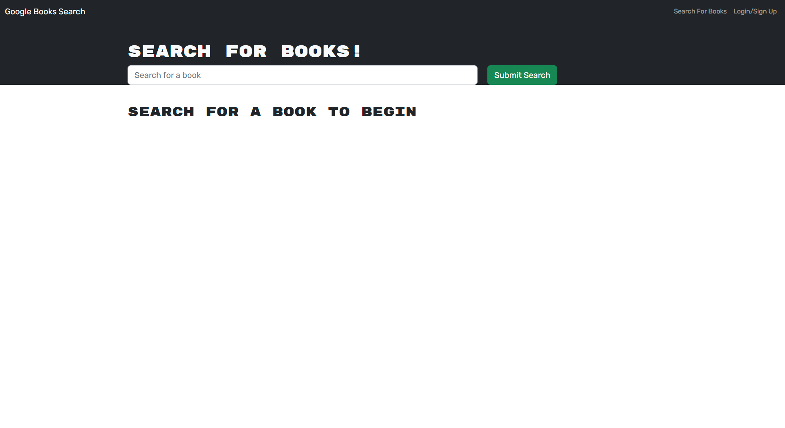

# Book Search Engine
## Description

The Book Search Engine is an exercise to practice MERN technologies. It utilizes a GraphQL API (Google Books API) built with Apollo Server, React front-end, MongoDB database, Node.js/Express.js, and Apollo Server.
  

## Installation and usage
To view the development, begin by installing the required packages: 
`npm run install`

Then build a local development instance using: 
`npm run develop`
  

### Heroku deployment
https://

 

### Screenshot

